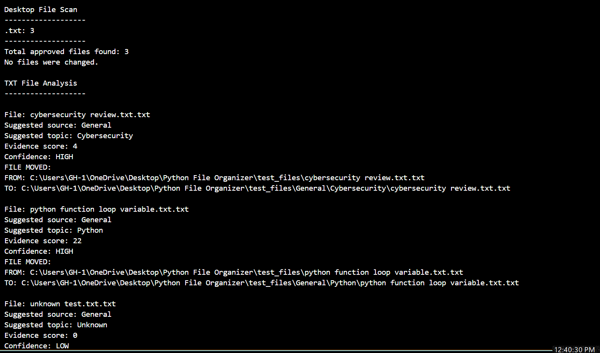
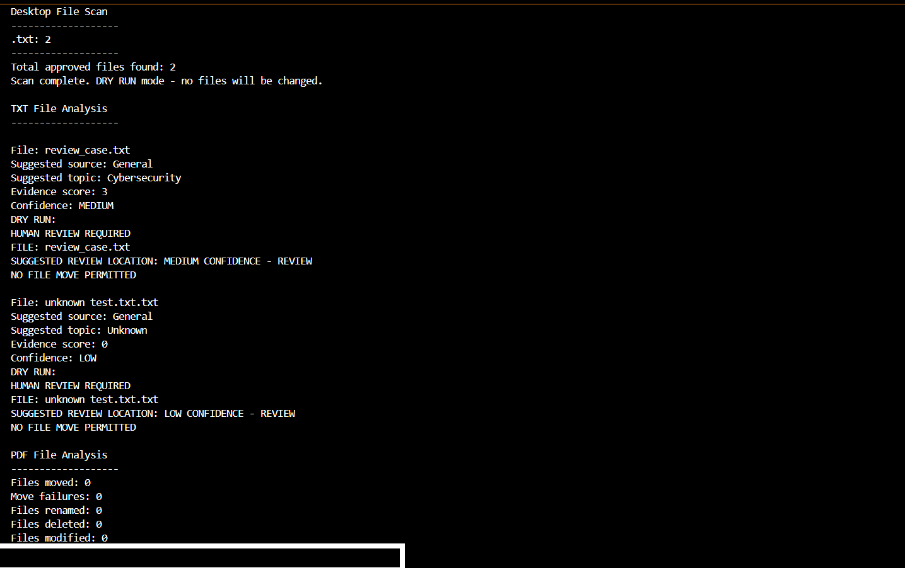

# Python Desktop File Organizer

## Evidence-Based File Classification & Automation

### Project Overview

I built this Python project to solve a real problem: my desktop contained a growing number of cybersecurity study materials, certification documents, PDFs, notes, and other files that needed to be organized.

Rather than creating a script that blindly moves files based on a single keyword, I wanted the program to examine available evidence, determine how confident it is in a classification, and automate a file move only when the evidence is strong enough.

The project follows a simple principle:

**Analyze first. Act only when confidence is sufficient.**

Files with uncertain classifications remain untouched for human review.

---

## The Problem

Manually organizing a large number of files is time-consuming and inconsistent. Simple automation can help, but automatically moving a file to the wrong location creates another problem.

I wanted the program to answer several questions before taking action:

* What type of file is this?
* Can useful text be extracted from it?
* Does the filename provide classification evidence?
* Does the document content provide additional evidence?
* What appears to be the source of the document?
* What is its primary topic?
* Are other topics also present?
* How strong is the evidence?
* Is the confidence high enough to permit an automated move?

This turned a basic file-organizing task into a small evidence-based decision system.

---

## How It Works

The program follows this general workflow:

```text
File
  ↓
Check approved file type
  ↓
Inspect filename
  ↓
Extract available document text
  ↓
Detect source
  ↓
Score topic evidence
  ↓
Detect additional topics
  ↓
Assign confidence
  ↓
HIGH ──────────→ Automated move permitted
MEDIUM / LOW ──→ Human review required
  ↓
Report results
```

---

## Evidence-Based Classification

The program uses keyword evidence from both filenames and available document text.

Filename evidence is weighted more heavily because a descriptive filename can provide a strong indication of the document's purpose. Content evidence can strengthen or supplement that classification.

The program calculates an evidence score and assigns one of three confidence levels:

### HIGH

The evidence is strong enough to permit automated file movement.

### MEDIUM

There is useful evidence, but not enough confidence to allow the program to move the file automatically.

The file remains untouched for human review.

### LOW

There is insufficient evidence for a reliable classification.

The file remains untouched for human review.

This approach intentionally favors avoiding incorrect automated actions over organizing every file automatically.

---

## Source Detection

The program can identify several document sources using filename and content evidence, including:

* Google Certifications
* Coursera
* WGU
* CompTIA
* General

The source becomes part of the proposed folder structure for HIGH-confidence files.

Example:

```text
General / Python
```

---

## Topic Classification

The classifier currently recognizes categories including:

* Python
* SQL
* Linux
* Cybersecurity
* Network Security
* Security+ Study
* Threat Analysis
* Phishing
* Vulnerability Assessments
* Portfolio Projects
* Scholarships
* Letters / References
* Financial Aid / Student Loans
* Receipts / Orders

The program can also identify secondary topics when evidence for more than one subject appears in a file.

---

## PDF Analysis

For PDF documents, the program attempts to:

1. Open the PDF safely.
2. Determine the number of pages.
3. Extract available text from up to the first 10 pages.
4. Use extracted text as classification evidence.
5. Fall back to filename evidence when no usable text can be extracted.
6. Stop automated processing and require human review when the PDF cannot be analyzed safely.

The program does not assume that failure to extract text means the document can be safely classified.

---

## Safety Controls

Safety was an important part of the design.

### Dry-Run Mode

The program supports:

```python
DRY_RUN = True
```

Dry-run mode allows the classification and proposed actions to be examined without changing the filesystem.

### Confidence Gate

Only HIGH-confidence classifications are permitted to reach the automated file-movement process.

MEDIUM and LOW confidence files remain in their original locations for human review.

### Overwrite Protection

Before moving a file, the program checks whether a file with the same name already exists at the destination.

If it does, the move is blocked.

### Error Handling

Exceptions during file analysis and file movement are caught and reported instead of silently ignored.

### Human Review

When evidence is insufficient—or a file cannot be analyzed—the program favors human review rather than guessing.

The current version does not automatically move uncertain files into a review folder. They remain in their original locations so that an uncertain automated decision does not alter the filesystem.

---

## Testing

I tested the program using both real desktop files and controlled test cases.

### Invalid Target Directory

**Purpose:** Determine what happens when the configured directory does not exist.

**Result:** PASS

The program stopped and reported the invalid target rather than continuing with an incorrect filesystem location.

### Dry-Run Scan

**Files detected:** 57 approved files

**Result:** PASS

The program scanned and analyzed files while making no filesystem changes.

### HIGH-Confidence Classification

A controlled Python test file produced:

```text
Suggested topic: Python
Evidence score: 22
Confidence: HIGH

DRY RUN:
SAFE MOVE TEST:
WOULD MOVE: python function loop variable.txt.txt
TO PATH: General / Python
```

**Result:** PASS

The program correctly permitted the proposed automated action while DRY RUN prevented the actual move.

### MEDIUM-Confidence Classification

A cybersecurity-related test produced:

```text
Evidence score: 3
Confidence: MEDIUM

HUMAN REVIEW REQUIRED
NO FILE MOVE PERMITTED
```

**Result:** PASS

### LOW-Confidence Classification

A file with insufficient classification evidence produced:

```text
Evidence score: 2
Confidence: LOW

HUMAN REVIEW REQUIRED
NO FILE MOVE PERMITTED
```

**Result:** PASS

### PDF Text Extraction

A readable PDF successfully produced:

```text
Text extraction: SUCCESS
Characters extracted: 11943
```

The extracted information was then used during classification.

**Result:** PASS

### PDF Analysis Failure

When a PDF could not be analyzed, the program produced:

```text
ANALYSIS FAILED - HUMAN REVIEW REQUIRED
SUGGESTED REVIEW LOCATION: COULD NOT ANALYZE - REVIEW
NO FILE MOVE PERMITTED
```

**Result:** PASS

---

## Test Results

At the end of the Version 14 dry-run test:

```text
Files moved: 0
Move failures: 0
Files renamed: 0
Files deleted: 0
Files modified: 0
```

This confirmed that the program evaluated the files without changing the filesystem.

---

## Test Evidence

### Live Automation Test

The following controlled LIVE-mode test demonstrates that HIGH-confidence classifications are permitted to move automatically.



### Human Review Safety Test

The following DRY RUN demonstrates the confidence gate. MEDIUM- and LOW-confidence files require human review and are not permitted to move automatically.



## What I Learned

This project helped me apply Python to a real problem rather than completing an isolated programming exercise.

Some of the most important lessons were:

* Breaking a larger problem into smaller functions
* Working with files and filesystem paths
* Reading text files
* Extracting text from PDFs
* Using dictionaries and lists
* Using loops and conditional statements
* Designing functions with parameters and return values
* Implementing weighted evidence scoring
* Handling exceptions
* Testing before enabling automated actions
* Debugging indentation and control-flow problems
* Recognizing the difference between a classification and sufficient evidence to act on that classification

One of my biggest lessons was that successful automation is not simply about making a computer perform an action.

It is also about deciding **when the computer should not act**.

---

## Cybersecurity Relevance

Although this project organizes desktop files rather than security alerts, I intentionally used concepts that are relevant to cybersecurity analysis.

An analyst often needs to:

1. Gather evidence.
2. Evaluate multiple indicators.
3. Determine whether the evidence is strong enough to support a conclusion.
4. Recognize uncertainty.
5. Avoid allowing assumptions to replace evidence.
6. Escalate uncertain situations for human investigation.
7. Take action only when the available evidence supports it.

The same philosophy influenced this project.

**Evidence first. Assumptions last.**

---

## Future Improvements

Possible future improvements include:

* Generate a human-review report
* Record results in a structured log file
* Add timestamps to scan results
* Add additional document formats
* Improve PDF handling
* Expand classification categories
* Move configuration into a separate configuration file
* Add automated unit tests
* Add command-line arguments
* Improve evidence scoring using additional context
* Create a summary showing HIGH, MEDIUM, and LOW confidence totals

Future changes should preserve the project's central safety principle:

**Uncertain evidence should not automatically trigger a filesystem change.**

---

## Technologies Used

* Python
* `pathlib`
* `shutil`
* `pypdf`
* Visual Studio Code
* Windows / PowerShell

---

## Project Status

**Version:** 14
**Status:** Tested portfolio candidate
**Default operating mode:** Dry Run

The project is being developed as part of my cybersecurity portfolio to demonstrate Python automation, structured problem solving, testing, debugging, and evidence-based decision making.
